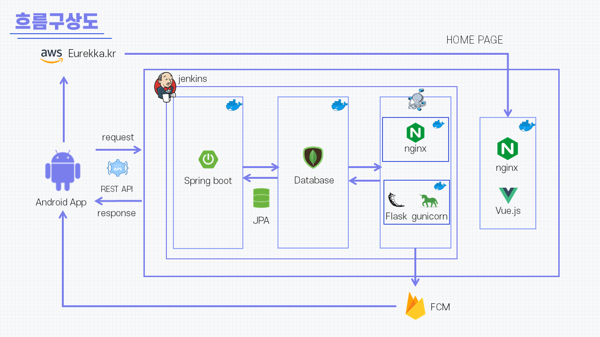
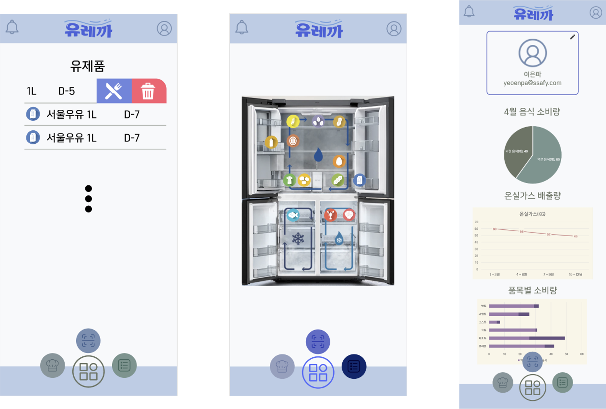

<h1>A404 - N차수열</h1>


<div>
    
    
     
     
    
    
    
    
    
    
    
    
</div>


<h3><a href="">Notion으로 가기</a></h3>

<h3><a href="">UCC 바로가기</a></h3>

<div>
  	바쁜 현대인을 위해 언제 어디서나 간편하게 냉장고 관리할 수 있는, 보유하고 있는 식품을 토대로 레시피를 추천해 주는,<br> 통계로 소비 습관을 한 눈에 볼 수 있는 모바일 애플리케이션입니다! 
</div>


## :book: 목차

### 🛀 [프로젝트 소개](#프로젝트-소개)

- 유통기한 - 냉장고 관리
- 레시피 추천
- 소비 습관 통계

### 🍴 [유레까 준비 과정](#)

- 흐름구상도
- 와이어프레임

### 🐳 [유레까 공유 수단](#음악-공유-수단)​

* Frontend / Backend의 사용 Package
* 코드 실행 방법

### 🧚‍♂️👩‍💻👩‍🎨👩‍🚀👩‍🍳[크루원 소개](#크루원-소개)


## 프로젝트 소개

> **유레까**
>
> "유통기한"부터 "레시피"까지 

#### 	유통기한 - 언제 어디서나 간편한 냉장고 관리

​		바코드 스캔과 OCR로 촬영하여 한 번에 식품등록 끝, 유통기한 임박 식품 알림까지 체계적인 관리 서비스를 제공해요.

#### 	레시피 고민 끝!

​		보유한 식품이 많이 포함된 레시피와 유통기한 임박한 식품 맞춤 레시피 모두 추천 받을 수 있어요.

#### 	통계로 소비 습관을 한 눈에!

​		월별/종류별 음식 소비량을 파악해, 올바른 소비 습관을 기르고, 온실 가스를 줄여 나가요.


## 유레까 준비 과정




### 와이어프레임




## 유레까 수단

#### Frontend 구성 요소

|  기술 스택   | Version | Comment                  |
| :----------: | :-----: | :----------------------- |
| React-native | 0.63.4  | 모바일 애플리케이션 제작 |
|    Vue.js    |  3.0.0  | 홈페이지 제작            |
|  vue-router  | 4.0.0-0 | vue SPA 페이지 제작      |
|     vuex     | 4.0.0-0 | vue SPA state 관리       |

|          React Native 라이브러리          | Version | Comment                                                 |
| :---------------------------------------: | :-----: | :------------------------------------------------------ |
|                   axios                   | 0.21.1  | 서버로 API 요청을 보내기 위해 사용                      |
| @react-native-async-storage/async-storage | 1.15.4  | Localstorage처럼 key-value storage를 저장하기 위해 사용 |
|     @react-native-firebase/messaging      | 11.5.0  | firebase에서 push notification 받아오기 위해 사용       |
|      @react-native-seoul/kakao-login      |  3.1.1  | 카카오 로그인 api를 적용하기 위해 사용                  |
|       @react-navigation/bottom-tabs       | 5.11.10 | footer에서 화면을 이동하기 위해 사용                    |
|         @react-navigation/native          |  5.9.4  | stack, tab navigation을 담는 navigator 생성을 위해 사용 |
|          @react-navigation/stack          | 5.14.1  | 화면을 이동을 위한 stack navigation 생성을 위해 사용    |
|          react-native-camera-kit          | 11.1.0  | 카메라로 바코드를 인식하기 위해 사용                    |
|          react-native-chart-kit           | 6.11.0  | LineChart, PieChart를 그리기 위해 사용                  |
|         react-native-date-picker          |  3.3.0  | 날짜 선택 모달 구현을 위해 사용                         |
|       react-native-gesture-handler        | 1.10.3  | swipe gesture를 위해 사용                               |
|         react-native-image-picker         |  3.6.0  | 사진을 촬영해 임시로 저장하고 서버에 보내기 위해 사용   |
|            react-native-paper             |  4.8.1  | Material Design을 사용하기 위해 사용                    |
|      react-native-push-notification       |  7.3.1  | push 알림을 관리하기 위해 사용                          |
|          react-native-unimodules          | 0.13.3  | Expo SDK의 라이브러리 적용하기 위해 사용                |
|             styled-components             |  5.2.3  | 앱 공용 색상 지정을 위해 사용                           |
|        sharingan-rn-modal-dropdown        |  1.3.1  | 드롭다운을 적용하기 위해 사용                           |

#### Backend 구성 요소

| 기술 스택  |   Version   | Comment                                       |
| :--------: | :---------: | :-------------------------------------------- |
|  OpenJDK   |     11      | Java                                          |
| SpringBoot |    2.4.5    | Rest API 웹 애플리케이션 개발                 |
|   Gradle   |    6.8.3    | 프로젝트를 빌드하고 라이브러리를 관리 도구    |
|    JPA     |    2.4.5    | 서버와 DB의 연동을 위해 사용                  |
|   Flask    |    2.0.0    | python으로 Scheduling Server 구축             |
|  MongoDB   |    4.4.3    | DB                                            |
|  Jenkins   |   2.277.4   | GitLab과 연동하여 자동 빌드 및 배포           |
|   Ubuntu   | 20.04.2 LTS | 서비스 제공을 위해 리눅스 서버 구축           |
|   Docker   |   20.10.2   | 컨테이너화 된 애플리케이션 관리               |
|   Nginx    |    1.15     | Vue 클라이언트 웹 서버 사용 & Flask 서버 연동 |
|  Firebase  |   27.1.0    | push 알림 기능 구현                           |

|  Spring 라이브러리  | Version | Comment                                |
| :-----------------: | :-----: | :------------------------------------- |
|     Spring Web      |  2.4.5  | Rest API 서버 구축                     |
|         JWT         | 3.15.0  | json 웹 토큰 발급하여 로그인 기능 구현 |
| Spring Data MongoDB |  2.4.5  | MongoDB 연결                           |
|   Spring Data JPA   |  2.4.5  | DB와의 연결 관리                       |
|       Lombok        | 1.18.20 | Getter, Setter 등 빠른 구현            |
| jackson-annotations | 2.12.1  | jackson annotation방식 사용            |
|        gson         |  2.8.2  | mattermost 통신에 사용                 |
|       swagger       |  2.9.2  | API 웹 문서화                          |
|        json         |    -    | json 데이터 포맷 사용                  |
|        slf4j        | 1.7.30  | 로그 기록                              |


| Flask 라이브러리 | Version | Comment                                                |
| :--------------: | :-----: | :----------------------------------------------------- |
|   APScheduler    |  3.7.0  | 알람을 위한 Scheduling 기능 구현                       |
|  Flask-PyMongo   |  2.3.0  | DB와의 연결                                            |
|     pymongo      | 3.11.4  | DB 관리                                                |
|      pandas      |  1.2.4  | 데이터(Dataframe) 헨들링                               |
|      numpy       | 1.20.3  | 행렬 변수 헨들링                                       |
|      pyfcm       |  1.5.1  | Flask에서 Firebase Cloud Messaging 사용                |
|   scikit-learn   | 0.24.2  | 추천 서비스 구현                                       |
|     gunicorn     | 20.1.0  | 웹서버와의 연결하는 WSGI(Web Server Gateway Interface) |


## 코드 실행 방법

#### 🐳Docker 설치하기

#### Clone Repository

```bash
git clone https://lab.ssafy.com/s04-final/s04p31a404.git
cd S04P31A404
```

- ### Frontend 실행 방법

  - eurekka.kr에서 다운로드 가능
  - frontend/README.md 참조

- ### Backend 실행 방법

  - backend/README.md 참조

- ### DB 구축

  - **Docker에서 MongoDB 설치**

    MongoDB 이미지 받아오기

    ```bash
    $ docker pull mongo
    ```

    설정한 MongoDB에 recipe.csv와 barcode.csv를 import


## 크루원 소개

### 🧚‍♂️👩‍💻👩‍🎨👩‍🚀👩‍🍳 N차수열 팀

* 🧚‍♂️**안준웅** - *PM, backend*- [ajx0114](https://lab.ssafy.com/ajx0114)
* 👩‍🚀**권연욱** - *frontend* - [w00k0805](https://lab.ssafy.com/w00k0805)
* 👩‍🎨**박서연** - *frontend* - [psy3153](https://lab.ssafy.com/psy3153)
* 👩‍💻**송현아** - *backend* - [sohyua2](https://lab.ssafy.com/sohyua2)
* 👩‍🍳**정수림** - *backend* - [smill5059](https://lab.ssafy.com/smill5059)


### :star: Git Branch 전략

### branch

```bash
(master) -> (develop) -> (feature/feature명/fe(be))
```

* master : 배포 가능한 상태로 유지
* develop : 개발용 최상위 branch
* fetaure : 기능별 branch

### commit

```bash
Commit 메시지는 행위: 설명, 내용은 파일명: 상세 작업 내용으로 구성
    예시]
        Modify ProductListScreen.tsx
        - frontend/src/screens/ProductListScreen.tsx : 식품 리스트 수정
```

### merge

```bash
merge 하기 전에 현재 작업 진행 상황 공유
merge 권한은 모두가 가지고 있지만 같은 팀의 다른 사람에게 리뷰 신청 후 merge 하기
merge 후 불필요한 branch 지우기
```