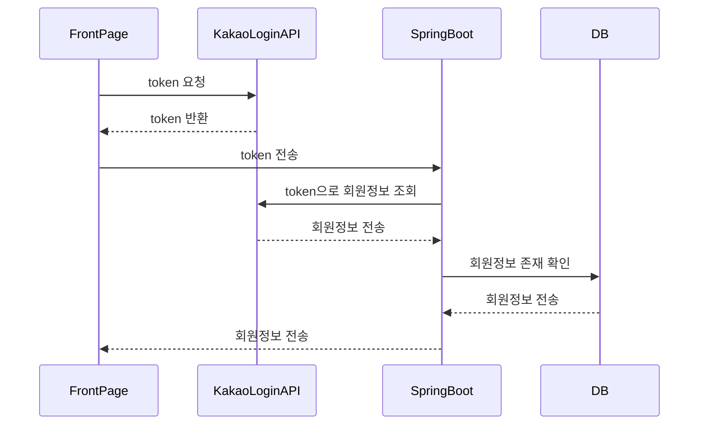
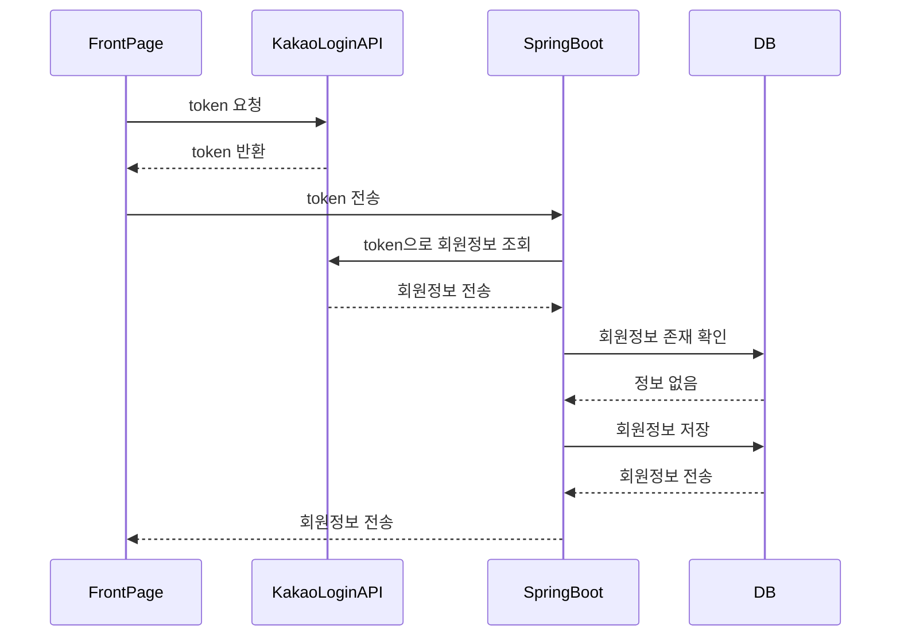
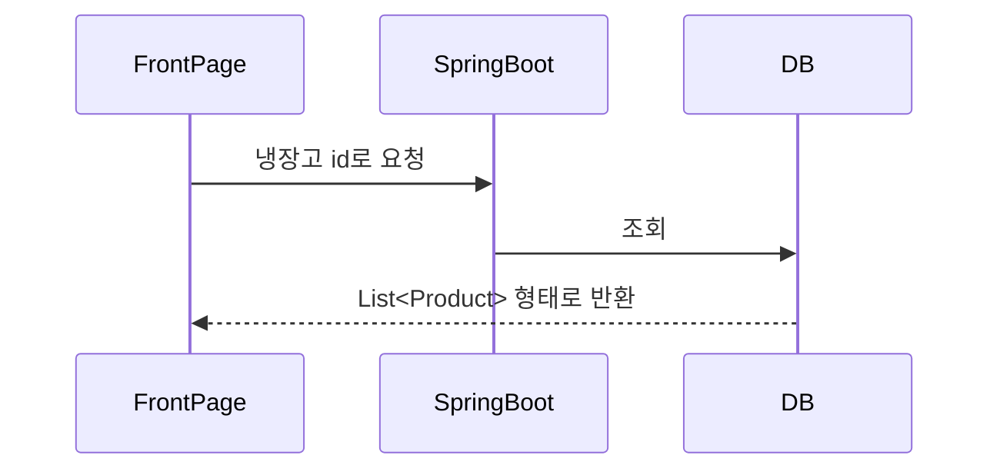
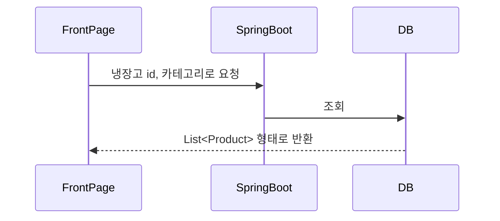
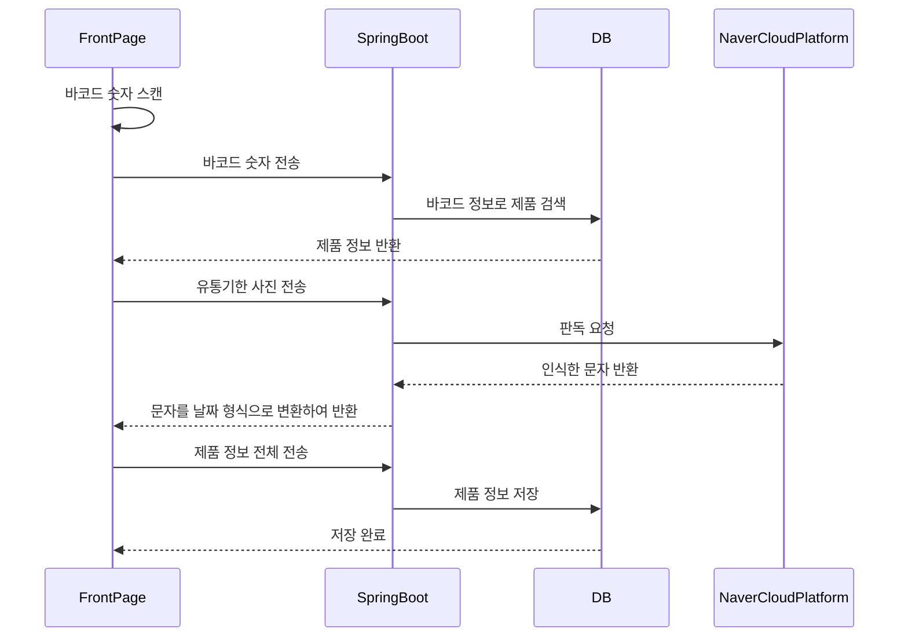
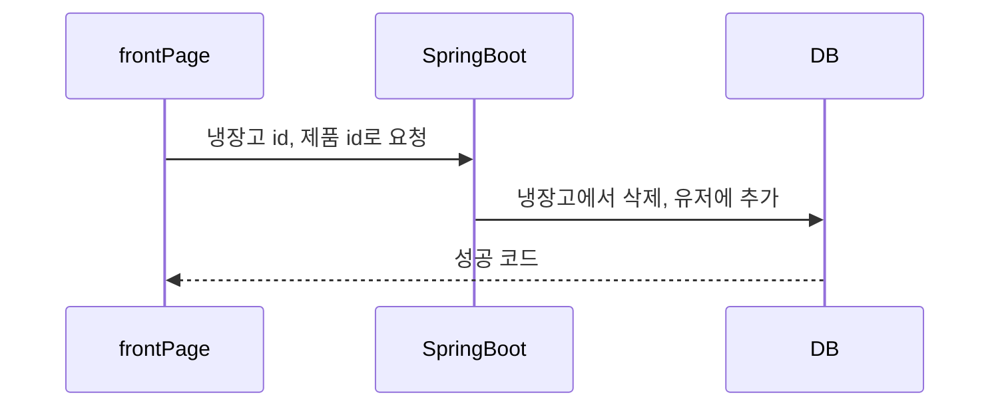
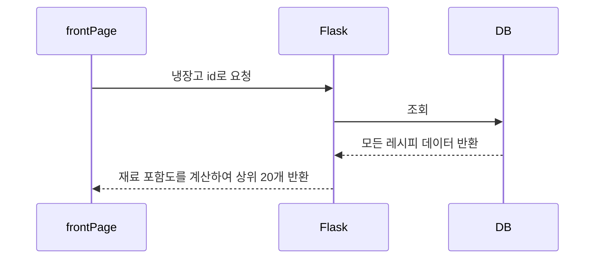
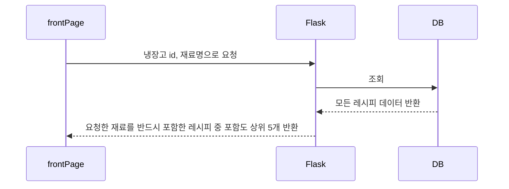

# 유레까 - 유통기한부터 레시피까지

## 1. 로그인

카카오 로그인 API를 통해 로그인을 진행

## 2. 회원 가입

카카오 로그인 API를 통해 회원가입 진행

## 3. 제품 목록 조회

#### 전체 목록 조회

#### 카테고리별 목록 조회

## 4. 제품 등록

제품 정보는 바코드, OCR / 직접 입력으로 등록한다.

## 4. 먹음/버림 처리

냉장고 id, 제품 id로 요청하여 먹음/버림 처리를 한다.

## 5. 레시피 추천

사용자의 냉장고에 있는 재료 개수, 유통기한에 임박한 제품을 고려하여 추천

#### 탭에서 접속 시

#### 유통기한 임박 알람에서 접속 시

